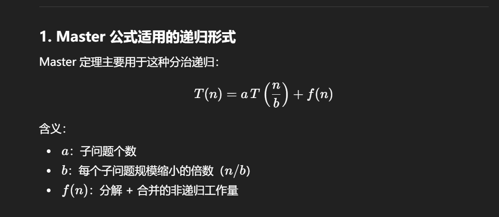
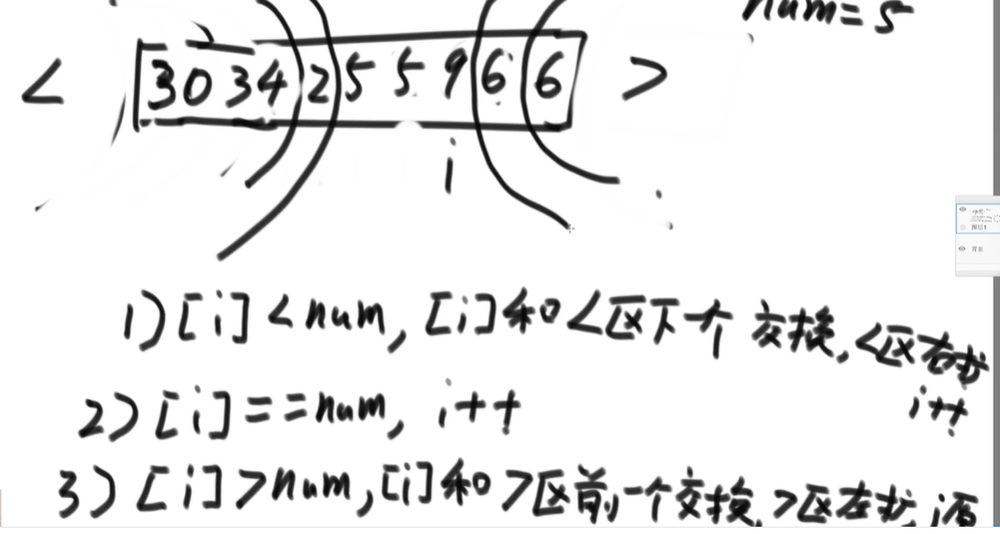
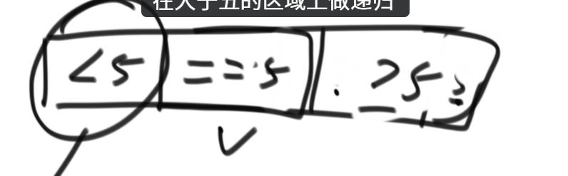
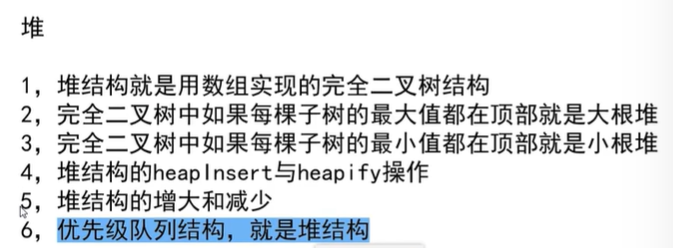
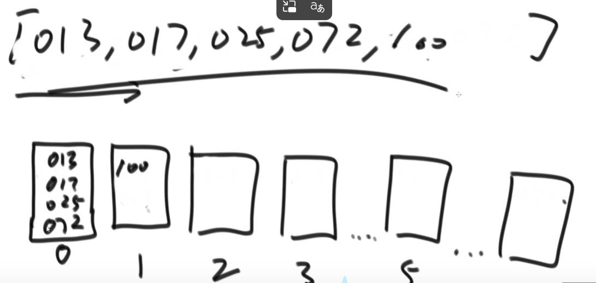
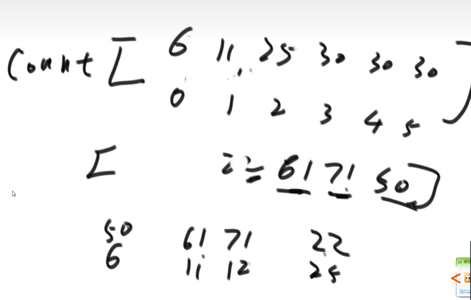

### 认识O（NlogN）排序

#### 二分法
- 代码实现
```cpp
 int process(int[]arr,int L,int R){
    if(L==R){
        return arr[L];
    }
    int mid=L+(R-L)>>1;//求中点，防止溢出，右移比除2快
    int left_value=process(arr,L,mid);
    int right_value=process(arr,mid+1,R);
    return Math.max(left_value,right_value);
}
```
- master公式求解时间复杂度

    - 此程序下：a=2 b=2 d=0也即 T(n)=2*T(n/2)+O(1)
    - 只要满足子程序调用规模相等就可以直接求解时间复杂度


#### 归并排序
- 通俗：先让左侧排序，再右侧排序，再归并在一起；相当于两个有序的序列合并，谁小谁拷贝进解果
- 代码实现
```cpp
void process(int[]arr,int L,int R){
    if(L==R){
        return ;
    }
    int mid=L+(R-L)>>1;//求中点，防止溢出，右移比除2快
    process(arr,L,mid);
    process(arr,mid+1,right);
    merge(arr,L,mid,R);
}
 void merge(int[] arr,int L,int mid,int R){
    int[] help=new int[R-L+1];
    int i=0;
    int p1=L;
    int p2=mid+1;
    while(p1<=mid && p2<=right){
        help[i++]= arr[p1]<=arr[p2] ? arr[p1++] :arr[p2++];
    }
    while(p1<=mid){
       help[i++]=arr[p1++]; 
    }
    while(p2<=right){
        help[i++]=arr[p2++];
    }
    for(int i=0;i<=help.length(),i++) arr[L+i]=help[i];
}
```
 - master公式中：a=2 b=2 d=1     log2(2)=1
 - 时间复杂度：O(NlogN)
 - 运用外排序：放在另一个数组再拷贝回来

#### O($N^2$)为什么差？（冒泡、比较）
- 浪费大量比较行为，才放置好一个数 

#### 小和问题
- 暴力解法:O($N^2$)
- merge法
  - [1,3,4,2,5]
  - 左侧有多少数比现在的数小->求右边有多少数比现在的数大 
  - 代码实现
```cpp
 int smallsum(int[] arr){
    if(arr==null||arr.length()<2)
    return 0;
return process(arr,0,arr.length()-1);
}

 int process(int[]arr,int L,int R){
    if(L==R){
        return 0;
    }
    int mid=L+(R-L)>>1;//求中点，防止溢出，右移比除2快
    return process(arr,L,mid)+process(arr,mid+1,right)+merge(arr,L,mid,R);//左边产生右边产生，merge的时候也产生
}
//既排序又求小和，一定要排序
 int merge(int[] arr,int L,int mid,int R){
    int[] help=new int[R-L+1];
    int i=0;
    int p1=L;
    int p2=mid+1;
    int res=0;
    while(p1<=mid && p2<=R){
        res+= arr[p1]<arr[p2] ? (R-p2+1)*arr[p1] : 0;//只有左小于右时求小和；个数*当前数
        help[i++]= arr[p1]<arr[p2] ? arr[p1++] :arr[p2++];//等于是要先拷贝右组
    }
    while(p1<=mid){
       help[i++]=arr[p1++]; 
    }
    while(p2<=right){
        help[i++]=arr[p2++];
    }
    for(int i=0;i<=help.length(),i++) arr[L+i]=help[i];
    return res;
}
```

#### 荷兰国旗问题
- 数字分区：给定数组与数字，以该数字分区左边是小于区，右边是大于区
- 升级：小于、等于、大于区严格分开


#### 快排
- 每次拿该序列的最后的一个元素作为依据排序
- 快排1.0

- 快排2.0

    - 快排2.0比1.0稍快一些，因为一次搞定一批数
- 最坏时间复杂度：O(&N^2&);产生原因：子递归划分太偏，退化成&N^2&
- 快排3.0
  - 随机选取数作为划分值，让好情况&坏情况变为概率事件
  - 代码实现
```cpp
 void quickSort(int[] arr,int L,int R){
    if(L<R>){
        swap(arr,L+(int)(Math.random()*(R-L+1)),R);//Math.random(),生成一个 [0.0, 1.0) 之间的随机浮点数
        int[] p=partition(arr,L,R);
        quickSort(arr,L,p[0]-1);
        quickSort(arr,p[1]+1,R);
    }
}
//L:当前要比较的指针 R:pivot位置
int[] partition(int[] arr,int L,int R){
    int less=L-1;//小于区的右边界，L一直是当前指针
    int more=R;//大于区的左边界
    while(L<more){
        if(arr[L]<arr[R]){
            swap(arr,++less,L++);//让less区的下一个元素和当前值交换，并扩充less区
        }
        else if(arr[L]>arr[R]){
            swap(arr,--more,L);//注意这里L指针不要自增，因为换过以后的L所指向值还没有比较
        }
        else{
            L++;//值相等时，当前指针自增就行，因为分区是小于区右边界，大于区左边界，中间就是相等区
        }
    }
    swap(arr,more,R);//把基准值放到中间
    return new int[] {less+1,more};//等于区范围是 [less + 1, more]，因为 pivot 最后被放到了 more，所以包含
}
```
- 快排空间复杂度（logN）
  - 思路：好情况坏情况分类的概率分布

### 详解桶排序以及排序内容大总结

堆-完全二叉树-数组从0出发的连续一段，有下标的对应关系
找子-2i+1(left) 2i+2(right)
找父-(i-1)/2
#### 大根堆：每一棵子树最大值是根节点
- 代码实现
```cpp
void heapInsert(int[] arr,int index){
    while(arr[index]>arr[(index-1)/2]){//a[0]>a[0],index=0时不会越界
        swap(arr[index],arr[(index-1)/2]);
        heapInsert(arr,(index-1)/2);//继续往上比较
    }
}
void heap headpfy(int[] arr,int index,int heapSize){
    int left=index*2+1;
    while(left<heapSize){
        int largest=(left+1<heapSize-1) && arr[left+1]>arr[left] ? left+1 : left;
        largest=arr[largest]>arr[index] ? largest : index;
        
        if(largest==index) break;//还是根节点大，就无需往下走
        swap(arr,largest,index);
        index=largest;
        left=index*2+1;
    }
}
```
    - 时间复杂度(logN)

#### 堆排序
- 代码实现
```cpp
void heapSort(int[] arr ){
    if(arr=null||arr.length<2){
        return;
    }
    for(int i=0;i<arr.length(),i++){//O(N)
        heapInsert(arr,i);//这一步将所给数组调整成了大根堆 O(logN)
    }
    int heapSize=arr.length;
    swap(arr,0,--heapSize);
    while(heapSize>0){//只要heapSize不为0，周而复始 O(N)
        heapify(arr,0,heapSize); //O(logN)
        swap(arr,0,--haapSize); //O(1)
    }
}
```
    - 时间复杂度 O(NlogN)
    - ==空间复杂度 O(1)==

#### 堆排序扩展题目
  
  - 小根堆（优先级队列）
  
#### 比较器的使用
- 实质：重载运算符
- 所有比较器规则
  - 返回负数时，第一个参数小，排前面
  - 返回正数时，第二个参数排前面
  - 返回0时，无所谓

比较器还可用在有序的结构里：小根堆、大根堆
- 更新规则
  - 返回负数时，第一个参数放在上面
  - 返回正数时，第二个参数排前面...

==以上所有排序都叫基于比较的排序==
#### 桶排序
不基于比较的排序应用范围窄，依赖于特定的数据状况
##### 基数排序
- 桶：容器，可以是队列、栈...

- 从个、十、百依次进桶、出桶
- 相当于从优先级最低的个位开始进桶，后续十、百位排序会保留个位排序后的信息

- 代码实现
```cpp
void radixSort(int[ ] arr){
    if(arr=nullptr||arr.length()<2) return;
    radisSort(arr,0,arr.length()-1,maxbits(arr));
    
}
int maxbits(int[] arr){//找到最大的数字共有多少位
    int max=0;
    for(int i=0;i<arr.length();i++){
        max=Math.max(max,arr[i]);
    }
    int res=0;
    while(max!=0){
        res++;
        max/=10;
    }
    return res;
}
void radixSort(int[] arr,int L,int R,int digit){
    int i=0,j=0;
    int radix=10;
    int[] count=new int[radix];//"10"个桶
    //count[0] 当前位是0的数字有多少
    //count[1] 当前位是0和1的数字有多少
    //count数组其实是前缀和了一次，count里面的索引是多少表示小于等于该数字的数字有多少
    int[] bucket=new int[R-L+1];
    for(int d=1;d<=dight;d++){//有多少位就进出桶多少次
    //分两部计算count数组
    for(int i=L;i<=R;i++){
        j=getDigit(arr[i],d);//第d位上是j的数字有多少个
        count[j]++;
    }
    for(int i=1;i<radix;i++){
        count[i]=count[i]+count[i-1];
    }

    for(i=R;i>=L;i--){//从右往左遍历，为什么？
        j=getDigit(arr[i],d);
        bucket[count[j]-1]=arr[i];
        count[j]--;
    }
    for(int i=L,j=0;i<=R;i++,j++){
        arr[i]=bucket[j];
    }
    }
} 
```
#### 排序总结


- 选择排序无稳定性
  
  - 代码实现
```cpp
  void selectionSort(vector<int>& arr) {
    int n = arr.size();
    for (int i = 0; i < n - 1; i++) {
        int minIdx = i;
        // 在未排序部分找最小元素
        for (int j = i + 1; j < n; j++) {
            if (arr[j] < arr[minIdx]) {
                minIdx = j;
            }
        }
        // 将最小元素交换到已排序部分末尾
        if (minIdx != i) {
            swap(arr[i], arr[minIdx]);
        }
    }
}
```
- 快速排序无稳定性：partition
- 堆排序无稳定性：很轻易破坏稳定性，只有父子交流

- 冒泡排序有稳定性：相等就不交换
  
  - 代码实现
```cpp
   void bubbleSort(vector<int>& arr) {
    int n = arr.size();
    for (int i = 0; i < n - 1; i++) {
        bool swapped = false;
        for (int j = 0; j < n - 1 - i; j++) {
            if (arr[j] > arr[j + 1]) {
                swap(arr[j], arr[j + 1]);
                swapped = true;
            }
        }
        // 优化：如果某趟没有发生交换，说明已经有序
        if (!swapped) break;
    }
}
```
- 插入排序有稳定性
  - 代码实现
```cpp
  // 插入排序：将未排序元素逐个插入到已排序部分的正确位置
// 时间复杂度：O(n²)，空间复杂度：O(1)
void insertionSort(vector<int>& arr) {
    int n = arr.size();
    for (int i = 1; i < n; i++) {
        int key = arr[i];
        int j = i - 1;
        // 将大于key的元素向后移动
        while (j >= 0 && arr[j] > key) {
            arr[j + 1] = arr[j];
            j--;
        }
        // 插入key到正确位置
        arr[j + 1] = key;
    }
}
```
- 归并排序有稳定性：merge时相等时先拷贝左边的